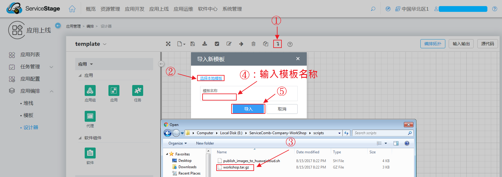
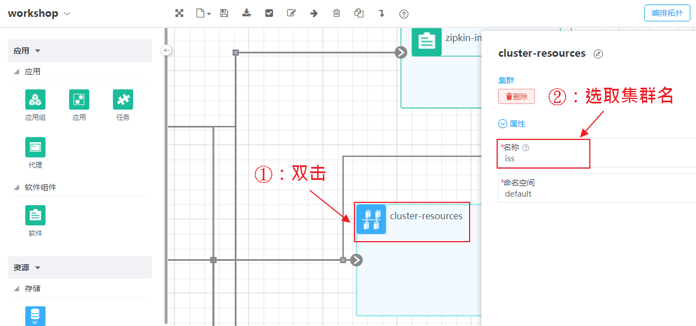
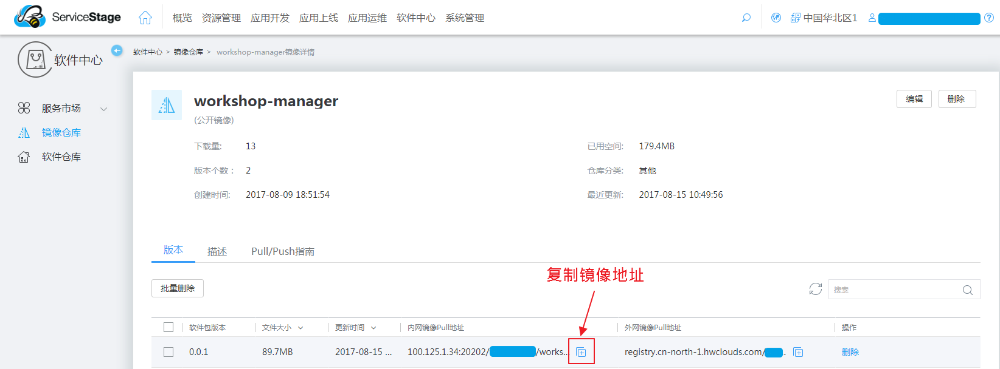
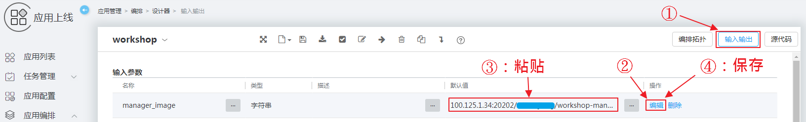
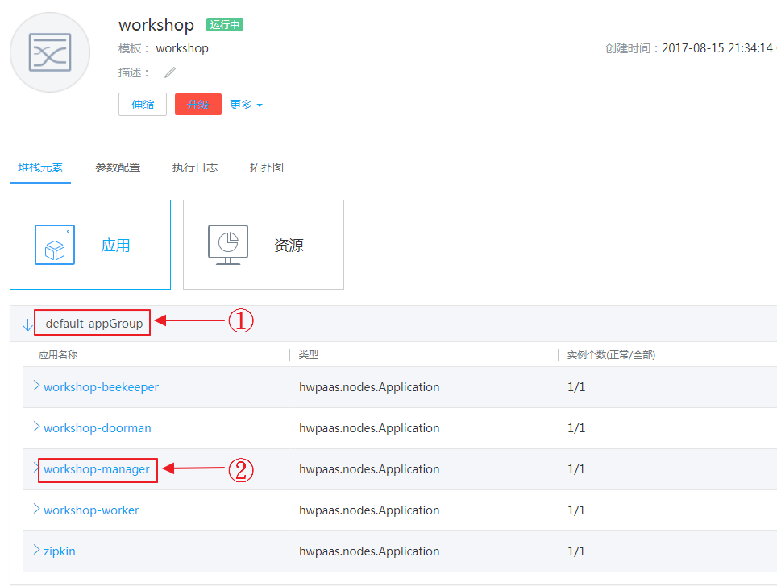
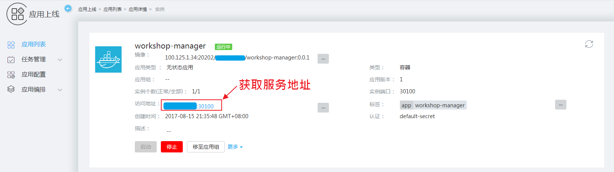

# 在华为云上自动部署微服务
## 背景
这个 company 的例子包含了4个服务（即部门经理、门卫、养蜂人和技工）。此外，我们还使用了 [zipkin](http://zipkin.io/) 来提供自动调用链追踪能力。因此，本指南将阐述在华为公有云上自动部署这5个服务的步骤，最终编排结构如图1所示。
  
图1 编排结构

## 导入编排模板
要导入编排模板，需要以下步骤：
1. 以*zip*或者*tar.gz*的格式对`scripts`目录下的`blueprint.yaml`的文件进行压缩
2. 访问Service Stage上的 [设计器](https://servicestage.hwclouds.com/servicestage/#/stage/doodle/new/topology)
3. 点击如图2所示的 *导入* 按钮
4. 点击如图2所示的 *选择本地模板*
5. 在弹出的文件框中选择步骤1中生成的压缩文件
6. 输入模板文件名, 如： company, 然后点击 *导入*
    
  图2 导入模板步骤  
  现在在网页上应该能看到类似于图1所示的编排结构图了。

## 自动部署
在部署集群之前，可能需要对一些属性进行更改。部署的步骤为：
1. 更新集群名. 如果你的集群名称已经是 company 了，则可以跳过这一步。  
  如图3所示，首先你需要双击 *cluster-resource* 按钮，然后选取你的集群名。
    
  图3 选取集群
2. 更新镜像地址。如果你没有构建并发布镜像到镜像仓库，则可以跳过这一步，直接使用我们提供的公共镜像。
  (1) 访问 [华为镜像仓库](https://servicestage.hwclouds.com/servicestage/#/stage/softRepository/mirrorCenter/myMirrorPack), 然后选择 *company\_manager* 镜像，点击如图4所示 *复制地址* 按钮。
    
  图4 复制镜像地址  
  (2) 如图5所示，首先你需要点击*输入输出*按钮，然后在输入参数名称一栏中找到*manager_image*并在该栏中点击*编辑*按钮，然后在默认值所在列粘贴步骤(1)中复制的镜像地址，并点击保存按钮。
    
  图5 更新镜像地址  
  对*doorman\_image*, *beekeeper\_image*, *worker\_image*和*zipkin\_image*重复步骤(1)和步骤(2)来更新镜像地址。
3. 部署。如图6所示，点击*保存模板*和*部署*按钮。然后点击*创建*按钮。  
    
  图6 保存并部署  
4. 访问 [堆栈](https://servicestage.hwclouds.com/servicestage/#/stage/stack/stacklist) 界面，检查堆栈运行状态。当集群颜色由蓝色变为绿色时，就说明集群已成功部署。然后就按图7所示进入经理服务详情页面，获取图8所示位置的服务地址，并通过项目首页中的[验证服务](https://github.com/ServiceComb/ServiceComb-Company-WorkShop#verify-services)一栏提供的方式去验证服务是否正常，同时也可以访问调用链跟踪服务，其运行于30411端口。
    
  图7 查看经理服务详情  
    
  图8 获取服务地址  
