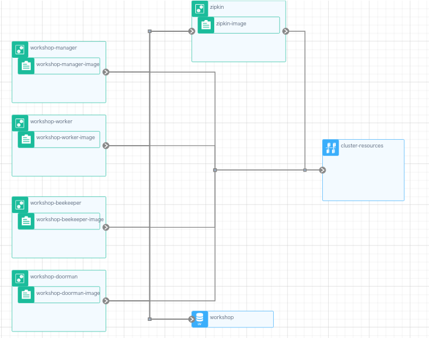
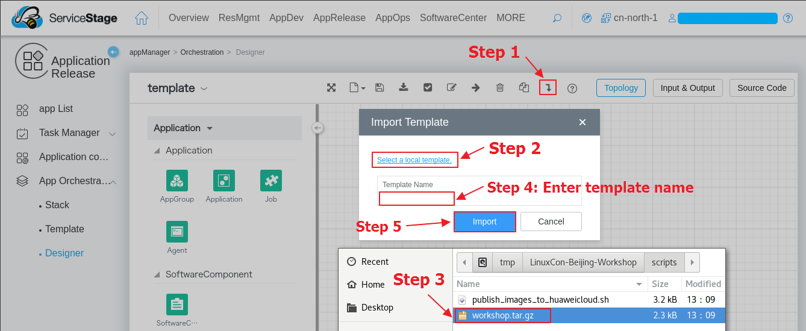
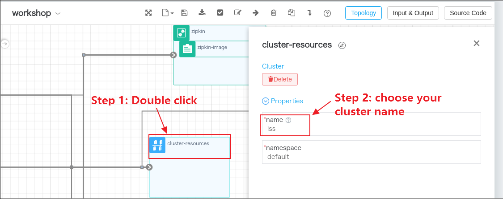
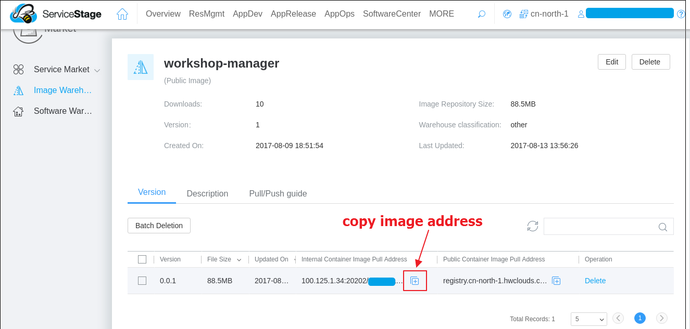
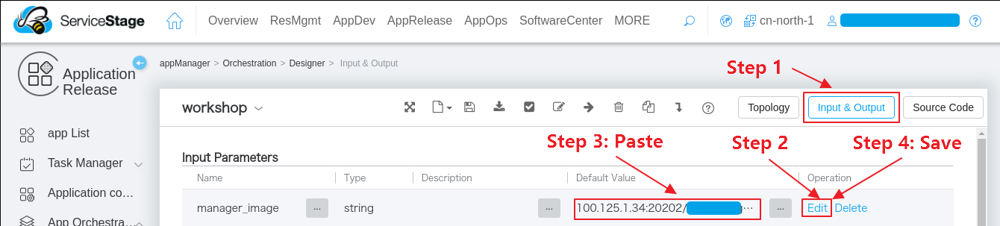
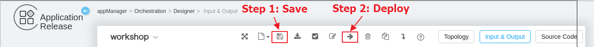
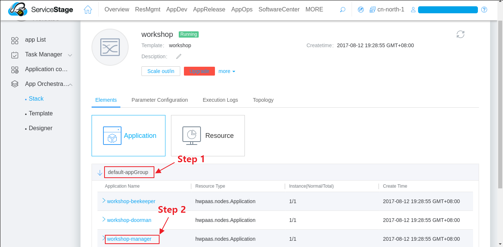
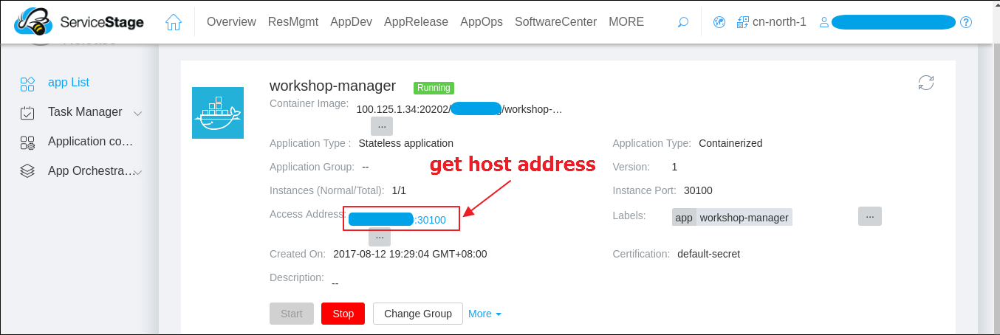

# Auto deploy microservices on Huawei Cloud
## Background
In this company demo, we have 4 services(manager, doorman, beekeeper, worker) and we use [zipkin](http://zipkin.io/) service to trace our handler chain. Hence, there should be 5 applications in this cluster as shown in the following figure(fig.1).
  
fig.1 orchestration architecture

## Import orchestration template
To import the orchestration template, you need the following steps:
1. Compress the file `blueprint.yaml` under the `scripts` folder in either *zip* or *tar.gz* format.
2. Visit [Service Stage's doodle page](https://servicestage.hwclouds.com/servicestage/#/stage/doodle/new/topology).
3. Click the *Import* button shown in fig.2. 
4. Click *Select a local template* shown in fig.2.
5. Select the compressed file in step 1.
6. Enter the template name, e.g. company, then click *Import*.
  
fig.2 steps to import template  
Now you should be able to see the orchestration architecture similar to the architecture in fig.1.

## Auto Deploy
Before you deploy your cluster, you may need to update some properties.
1. Update cluster name. You can skip this step if your cluster name is company.  
As shown in fig.3, first you need to double click the *cluster-resource* button, then choose the name
of your cluster.
  
fig.3 update cluster name  
2. Update images' url. If you did not build and publish your images to the image warehouse, you can skip this step and use the public images we provide in the image warehouse.  
(1) Visit [Huawei's Image Warehouse](https://servicestage.hwclouds.com/servicestage/#/stage/softRepository/mirrorCenter/myMirrorPack), then choose the *company\_manager* image. Click on the *copy address* button as shown in fig.4.
  
fig.4 copy image address  
(2) As shown in fig.5, first you need to click the *Input & Output* button, then click *Edit* on the line which name is *manager\_image*, then paste what we copy in step (1) and click the *Save* button.
  
fig.5 update image address  
Repeat step (1) and step (2) for the *doorman\_image*, *beekeeper\_image*, *worker\_image* and *zipkin\_image* options.  
3. Deploy. As shown in fig.6, save the template and then click deploy. After that, enter the stack name and click *Create* button.  
  
fig.6 save and deploy  
4. Check the stack status by visiting the [Stack](https://servicestage.hwclouds.com/servicestage/#/stage/stack/stacklist) page. When your cluster turns green, it means that it's ready and you can click your cluster. After that, click as fig.7 shown, then get the host address from fig.8. Then you can [verify services](https://github.com/ServiceComb/ServiceComb-Company-WorkShop#verify-services) with that hosts and replace port with 30411 to visit the zipkin service.
  
fig.7 view manager details  
  
fig.8 get host address  
